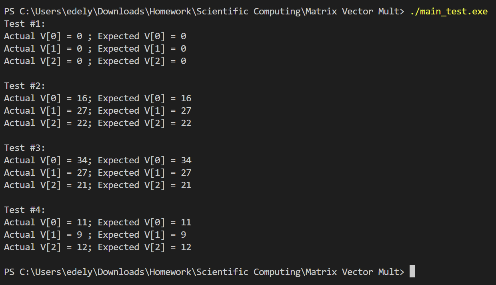
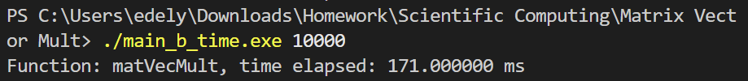
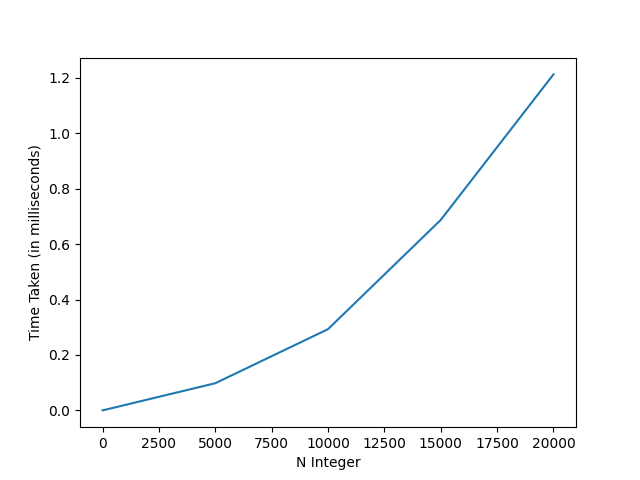

# Matrix Vector Multiplication Benchmark
This is a code used to run an analysis on a Matrix Vector Multiplication.

### To Run
```c
./main_test.exe
```

### Output


The output above tests the `matVectMult()` function to see whether or not the value of the multiplication produced by the code is the same as the expected value output. If it's the same, that means the code works correctly.

## Time Complexity

### To Run
```c
make time
./main_b_time.exe <integer>
```

### Output


`<integer>` here represents the N value, which is the size of the matrix and the vector dimension. In this example, the value that is used here is 10000. So, to calculate a matrix of size 10000, it requires 171 millisecond.

Here's a graph that shows the amount of time needed as the N size becomes higher.


## Space Complexity

### To Run
```c
make space
./main_b_space.exe <integer>
```

### Output


`<integer>` here represents the N value, which is the size of the matrix and the vector dimension. In this example, the value that is used here is 10000. So, to calculate a matrix of size 10000, it takes 390 KB.

Here's a graph that shows the amount of memory used as the N size becomes higher.

